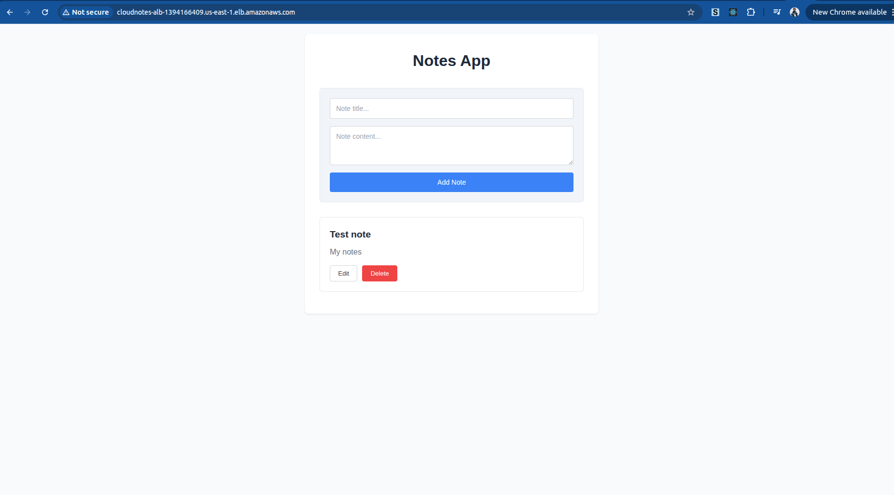
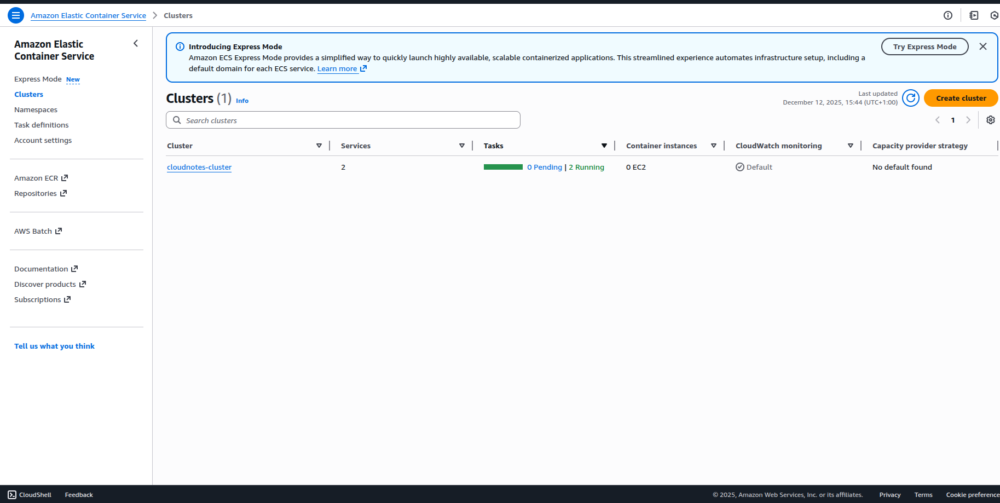
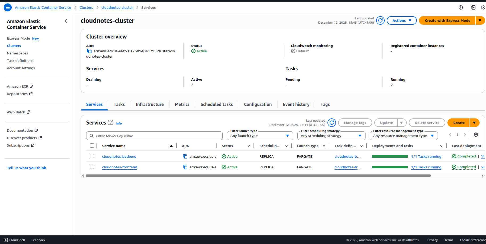

# CloudNotes


Full-Stack ToDo Notes Application deployed on AWS ECS Fargate.



## Tech Stack
- **Frontend**: React, Vite, TypeScript, Nginx (Docker)
- **Backend**: Node.js, Express, TypeScript, Alpine (Docker)
- **Infrastructure**: AWS ECS, Terraform, Docker Hub

## Getting Started

### Prerequisites
- Node.js (v20+)
- Docker & Docker Compose

### 1. Run Locally (Development)

To run the application without Docker for development purposes:

#### Backend
1. Navigate to the backend directory:
   ```bash
   cd backend
   ```
2. Install dependencies:
   ```bash
   npm install
   ```
3. Start the server:
   ```bash
   npm start
   ```
   The backend will run on `http://localhost:5000`.

#### Frontend
1. Open a new terminal and navigate to the frontend directory:
   ```bash
   cd frontend
   ```
2. Install dependencies:
   ```bash
   npm install
   ```
3. Start the development server:
   ```bash
   npm run dev
   ```
   The frontend will run on `http://localhost:5173` (or similar, check terminal output).

---

### 2. Run with Docker (Production-like)

We use optimized multi-stage Docker builds to keep image sizes minimal:
- **Frontend**: ~10MB (Alpine + Nginx)
- **Backend**: ~70MB (Alpine + Node.js)

#### Build and Run
1. From the root directory, build and start the containers:
   ```bash
   docker compose up -d --build
   ```

2. Access the application:
   - **Frontend**: [http://localhost:5173](http://localhost:5173)
   - **Backend API**: [http://localhost:5000](http://localhost:5000)

#### Stop
To stop and remove the containers:
```bash
docker compose down
```

### 3. Deploy to AWS (Terraform)

We use Terraform to provision the infrastructure on AWS (ECS Fargate, ALB, VPC).



1.  **Build & Push Images**: Ensure your Docker images are pushed to Docker Hub.
2.  **Deploy**:
    ```bash
    cd infrastructure

    terraform init

    terraform validate 
    
    terraform apply

    ## when you are done destroy the cluster and everything 
    terraform destroy --auto-approve
    ```
3.  **Services**: These are all the services that care been created


4. **Task definition**: Task definition as mentioned in the docs directory 


For detailed deployment steps, see [docs/deployment.md](docs/deployment.md).
